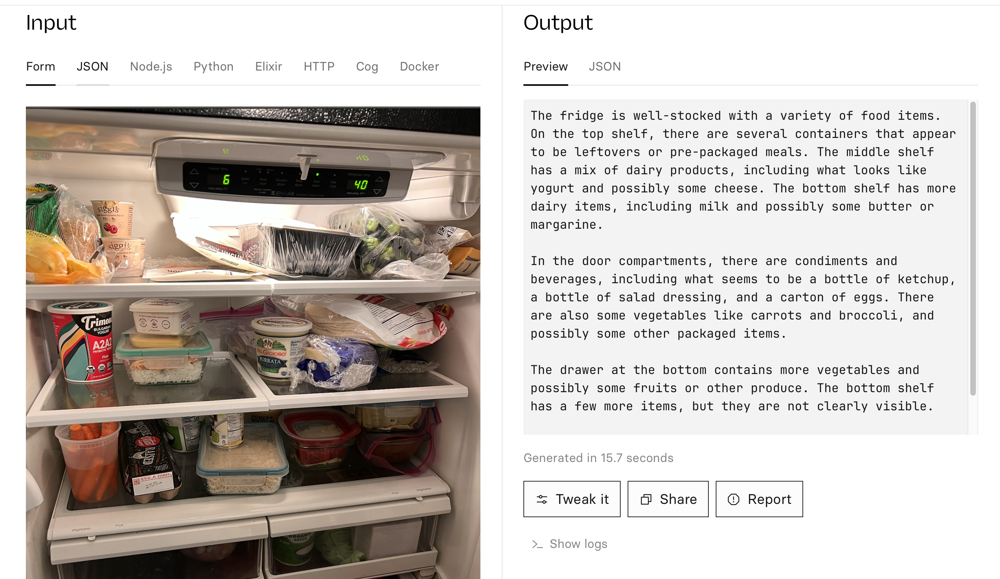
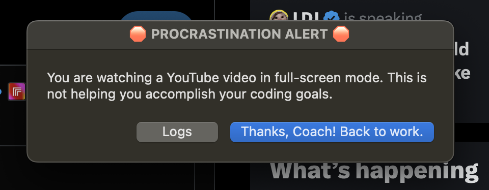
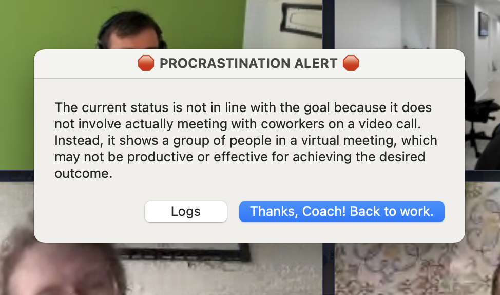
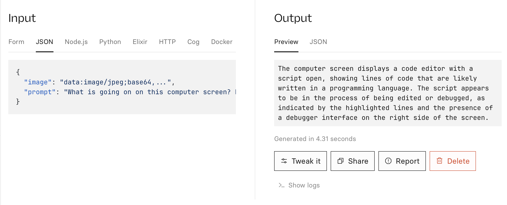
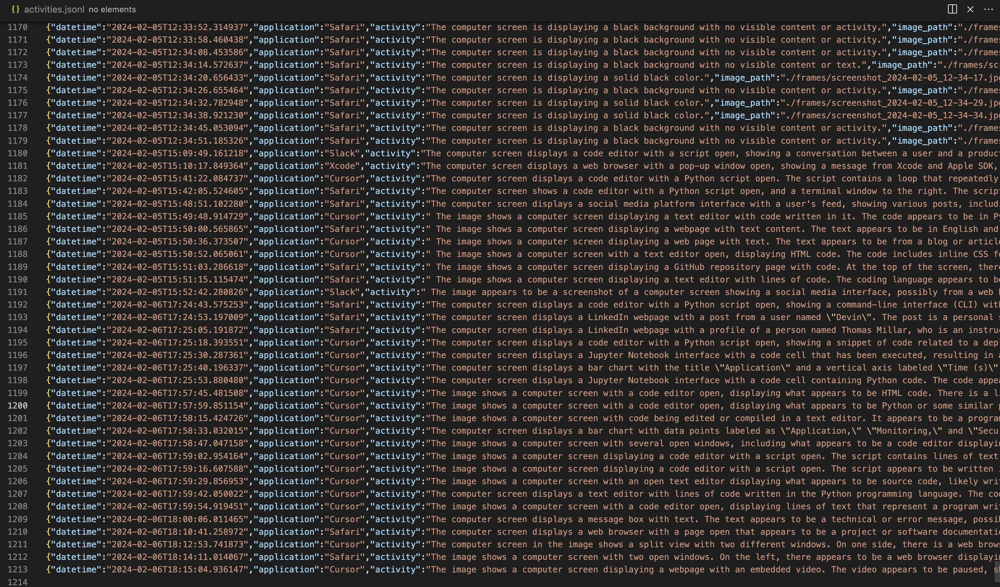
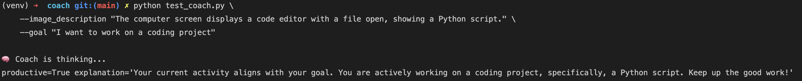
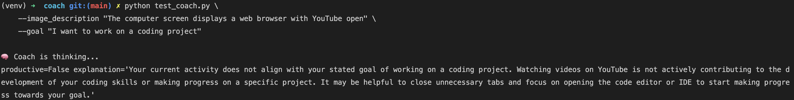

# ProcrastiCoach

Hi. I'm charlie. I work at replicate. It's an api for running models.

One of the cool models is llava. llava is like an open source alternative to GPT vision. What can you do with llava? 🤔



Well, I procrastinate a lot. So I procrastinated by making a thing that helps me stop procrastinating!




## How does it work?

### First, give coach your goal.

> python coach.py --goal "work on a coding project"

### Take screenshots every 2s

https://github.com/cbh123/coach/assets/14149230/afb9e7fe-6a8c-49d7-bde0-cc9d3002a461

### Ask Llava what it sees



### Ask MacOS what song is focused

`osascript -e 'tell application "System Events" to get the name of the first process whose frontmost is true'`

### Track activities in a JSON file



```json
{"datetime":"2024-02-07T10:41:49.612902","application":"Cursor","activity":" The image shows a computer screen with an open text editor displaying some code. It appears to be a Java or JavaScript file, as indicated by the syntax and structure of the text. The code includes comments that are likely instructions for the development team or notes about the code's purpose and functionality. Additionally, there is a message displayed above the code that seems to be an error or warning in a programming environment, typically a console output.\n\nThe specific details about the content of the code or the context of the error message are not clear from this image alone. ","image_path":"/Users/charlieholtz/workspace/dev/coach/frames/screenshot_2024-02-07_10-41-45.jpg","model":"ollama/llava:7b-v1.6-mistral-q4_0","prompt":"What is going on on this computer screen? Keep it very short and concise, and describe as matter of factly as possible.","goal":"work on a coding project","is_productive":true,"explanation":"Current activity shows an image of a computer screen with an open text editor displaying code, likely in Java or JavaScript, and a message displayed above the code which could be an error or warning. This appears to align with the goal of working on a coding project.","iteration_duration":null}
```

### Use a language model to decide whether current activity is productive





Note: it's interesting how this works. It runs on Llama-2 70B with support for jsonschema. So, I provide the coach with a prompt:

```python
f"""You are a productivity coach. You are helping me accomplish my goal of {goal}. Let me know if you think the description of my current activity is in line with my goals.

## Current status
Goal: {goal}
Current activity: {description}

## Your response:"""
```

And a JSON schema:

```json
{
  "$schema": "http://json-schema.org/draft-07/schema#",
  "type": "object",
  "properties": {
    "productive": {
      "type": "boolean",
      "description": "This should be 'true' if the activity is helping me accomplish my goal, otherwise 'false'"
    },
    "explanation": {
      "type": "string",
      "description": "This should be a helpful description of why I am not productive, only required if productive == false"
    }
  },
  "required": ["productive", "explanation"],
  "additionalProperties": false
}
```

And then we guarantee that the output is JSON:

```json
{"explanation": "Your current activity does not align with your stated goal of working on a coding project. Watching videos on YouTube is not actively contributing to the development of your coding skills or making progress on a specific project. It may be helpful to close unnecessary tabs and focus on opening the code editor or IDE to start making progress towards your goal.", "productive": false}
```

# see it live!

`python coach.py --goal 'work on a coding project' --cloud`

OR remove cloud flag to run locally on Ollama:

`python coach.py --goal 'work on a coding project'`

Optionally, activate hard mode:
`python coach.py --goal 'work on a coding project' --cloud`


## todo
- make a better llava example. fridge example.
- for each step until final demo, screenshot or link to prediction?
- add a list of the models that I'm using: llava, llama with function calling
