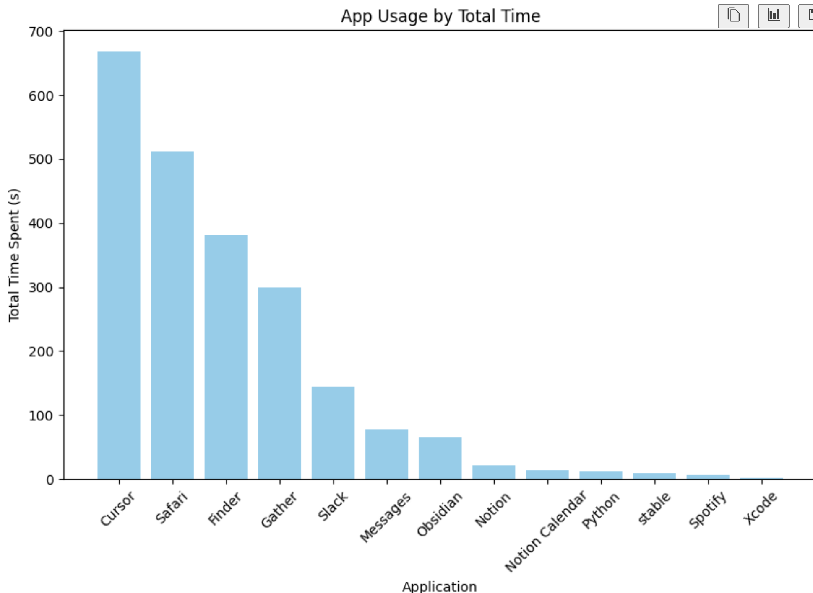

# Coach

I work at [Replicate](https://replicate.com/home). It's an API for running models.

One of the cool models is llava. llava is like an open source alternative to GPT vision. What can you do with llava? 🤔


Well, I procrastinate a lot. So I procrastinated by making a thing that helps me stop procrastinating!


# How does it work?

## First, give coach your goal.

> python coach.py --goal "work on a coding project"

## Take screenshots every 2s

https://github.com/cbh123/coach/assets/14149230/afb9e7fe-6a8c-49d7-bde0-cc9d3002a461

## Ask Llava what it sees


## Ask MacOS what app is focused

`osascript -e 'tell application "System Events" to get the name of the first process whose frontmost is true'`

## Track activities in a JSON file

Each activity is saved in this format:

```python
Activity(
    datetime: datetime
    application: str
    activity: str
    image_path: str
    model: str
    prompt: str
    goal: str = None
    is_productive: bool = None
    explanation: str = None
    iteration_duration: float = None
)
```


You can already do interesting things with this data:



## Use a language model to decide whether current activity is productive

```bash
> python test_coach.py \
>       --image_description "The computer screen displays a code editor with a file open, showing a Python script." \
>       --goal "work on a coding project"
>
> productive=True explanation='Based on the information provided, it appears that you have a code editor open and are viewing a Python script, which aligns with your goal of working on a coding project. Therefore, your current activity is considered productive.'
```

```bash
> python test_coach.py \
>       --image_description "The computer screen displays a web browser with YouTube Open" \
>       --goal "work on a coding project"
>
> productive=False explanation='Watching videos on YouTube is not helping you work on your coding project. Try closing the YouTube tab and opening your coding project instead.'
```

How do I guarantee that the output is JSON? Mixtral doesn't support function calling yet, so I just ask it nicely to give me JSON. I then use a library called [instructor](https://jxnl.github.io/instructor/) to retry if the output fails.

```python
f"""You are a productivity coach. You are helping me accomplish my goal of {goal}. Let me know if you think the description of my current activity is in line with my goals.

## Rules
Respond in a JSON format:

{{"productive": {{
        "type": "boolean",
        "description": "This should be 'true' if the activity is helping me accomplish my goal, otherwise 'false'"
    }},
    "explanation": {{
        "type": "string",
        "description": "This should be a helpful description of why I am not productive, only required if productive == false"
    }}
}}

And then I ask guarantee that the output is JSON:

```json
{"explanation": "Your current activity does not align with your stated goal of working on a coding project. Watching videos on YouTube is not actively contributing to the development of your coding skills or making progress on a specific project. It may be helpful to close unnecessary tabs and focus on opening the code editor or IDE to start making progress towards your goal.", "productive": false}
```

# See it live!

`python coach.py --goal 'work on a coding project' --cloud`

OR remove cloud flag to run locally on Ollama:

`python coach.py --goal 'work on a coding project'`

Optionally, activate hard mode:
`python coach.py --goal 'work on a coding project' --cloud`

Demo video:

https://github.com/cbh123/coach/assets/14149230/4fe11e17-f521-411b-960e-e8ed0a98ebc3


# Future ideas


What happens if you embed the text on your screen and see how far it is from distracting keywords?

`python ocr.py`

https://github.com/straussmaximilian/ocrmac


# Models
- [Llava 1.6](https://replicate.com/yorickvp/llava-v1.6-mistral-7b)
- [Mixtral](https://replicate.com/mistralai/mixtral-8x7b-instruct-v0.1)
- [BGE embeddings](https://replicate.com/nateraw/bge-large-en-v1.5)
